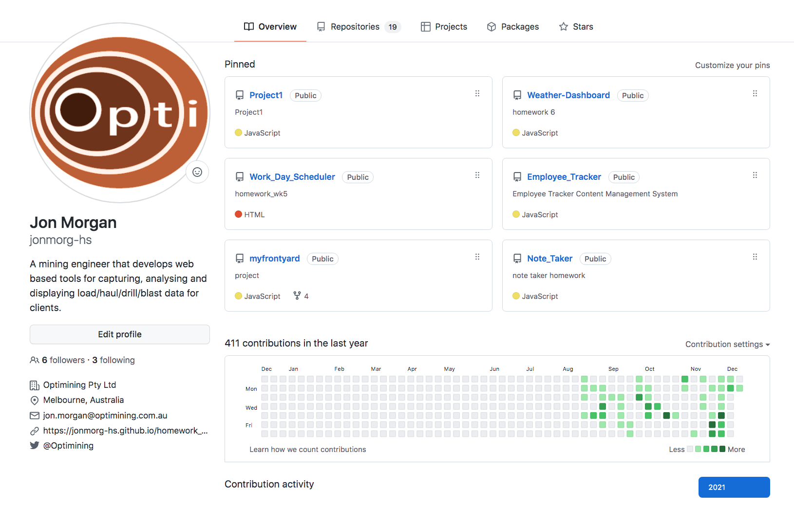
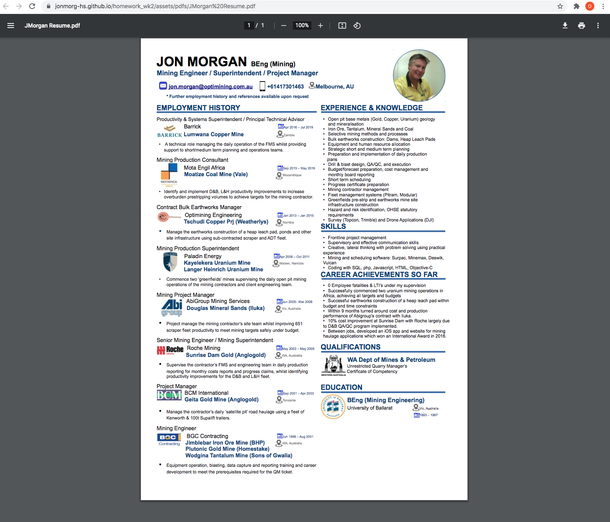
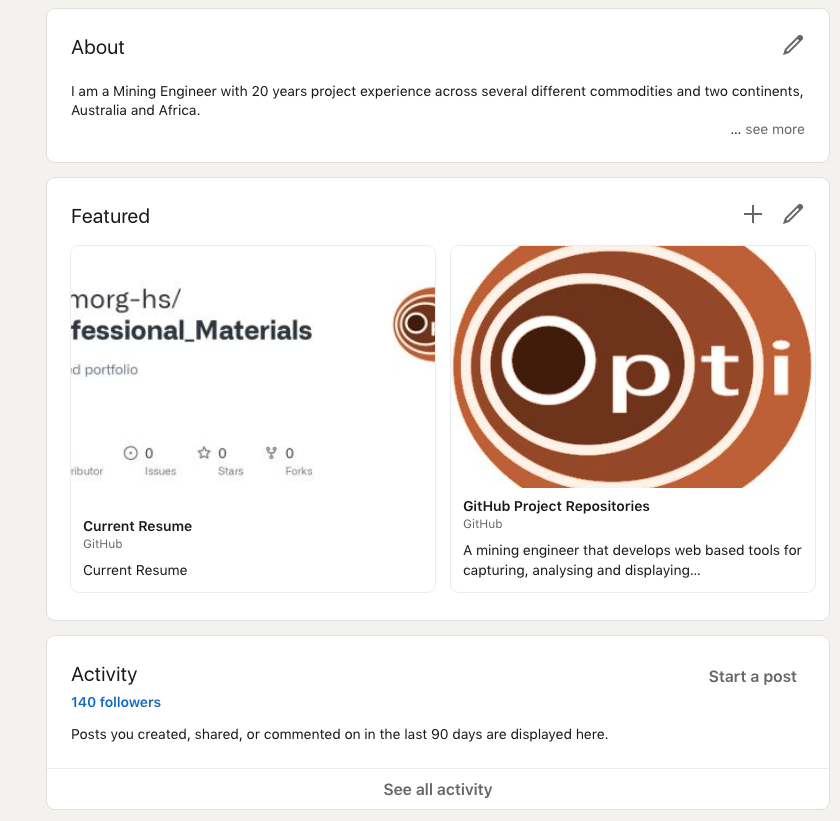
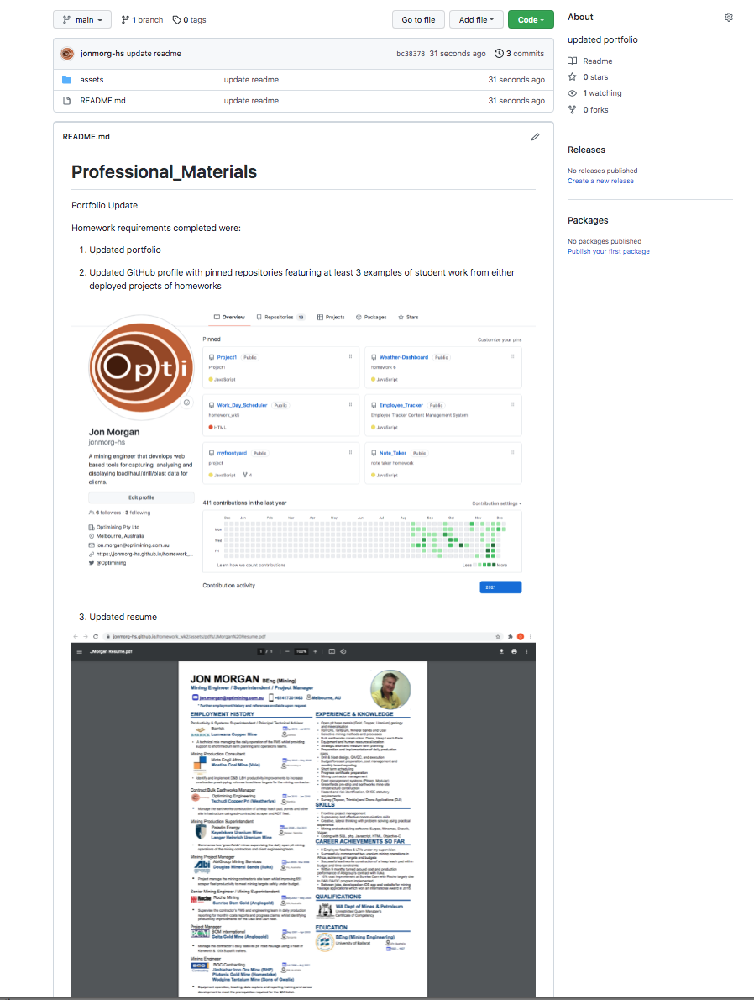

# Professional_Materials

Portfolio Update

Homework requirements completed were:

1. Updated portfolio

2. Updated GitHub profile with pinned repositories featuring at least 3 examples of student work from either deployed projects of homeworks

3. Updated resume

4. Updated LinkedIn profile

Examples of student work are accessible from the linked Github page.

https://github.com/jonmorg-hs/Professional_Materials

